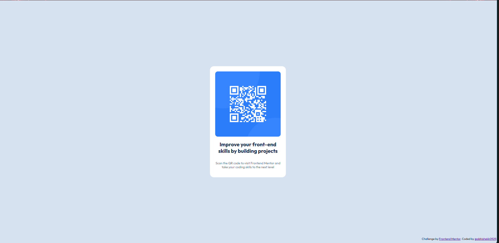

# Frontend Mentor - QR Code Component Solution

This is my solution to the [QR code component challenge on Frontend Mentor](https://www.frontendmentor.io/challenges/qr-code-component-iux_sIO_H). This project helped me practice HTML and CSS fundamentals, especially layout and responsive design.

## Table of Contents

- [Overview](#overview)
  - [Screenshot](#screenshot)
  - [Links](#links)
- [My Process](#my-process)
  - [Built With](#built-with)
  - [What I Learned](#what-i-learned)
  - [Continued Development](#continued-development)
  - [Useful Resources](#useful-resources)
- [Author](#author)
- [Acknowledgments](#acknowledgments)

## Overview

### Screenshot

<!-- Replace the path below with your actual screenshot file -->

### Links

- Solution URL:(https://www.frontendmentor.io/solutions/frontend-mentor-qr-code-card-design-ObaIj5KRM-)
- Live Site URL: https://abhishekk0929.github.io/qr-code-component-main/

## My Process

### Built With

- Semantic HTML5
- CSS custom properties
- Flexbox
- CSS Grid
- Mobile-first workflow

### What I Learned

- Improved my understanding of semantic HTML and accessibility
- Practiced CSS Grid and Flexbox for layout design
- Learned to use custom properties for consistent styling
- Strengthened my responsive design skills with media queries

## Continued Development

- Further explore advanced CSS Grid layouts
- Practice more with desktop media queries and browser compatibility
- Improve accessibility and ARIA usage

## Useful Resources

- [Frontend Mentor Help Center](https://www.frontendmentor.io/help)
- [CSS Tricks: A Complete Guide to Flexbox](https://css-tricks.com/snippets/css/a-guide-to-flexbox/)
- [MDN Web Docs: CSS Grid Layout](https://developer.mozilla.org/en-US/docs/Web/CSS/CSS_Grid_Layout)

## Author

- Frontend Mentor - [@abhishek0929](https://www.frontendmentor.io/profile/abhishekk0929)

